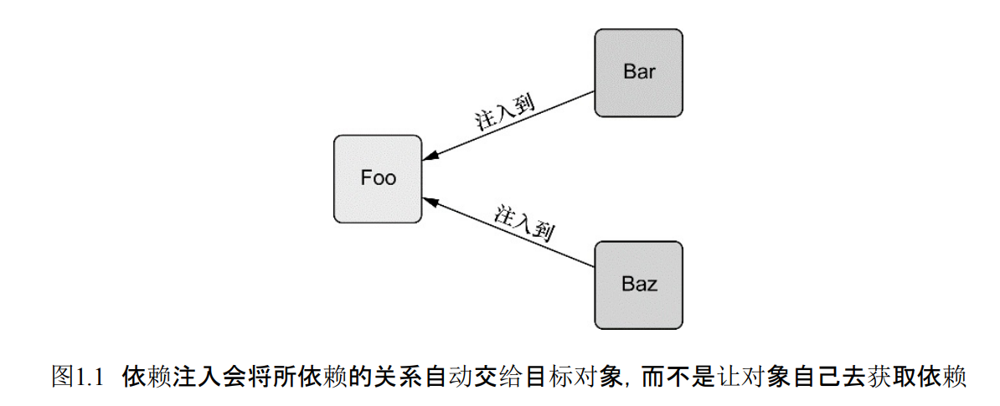
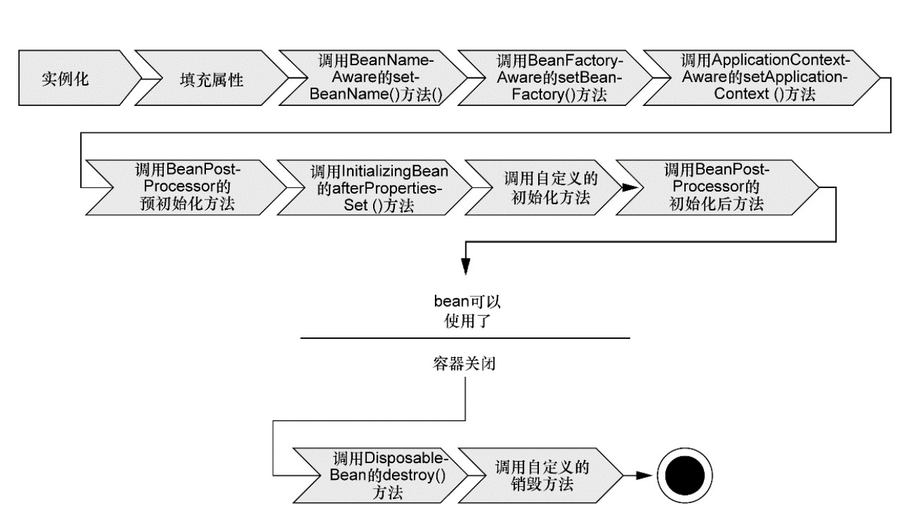
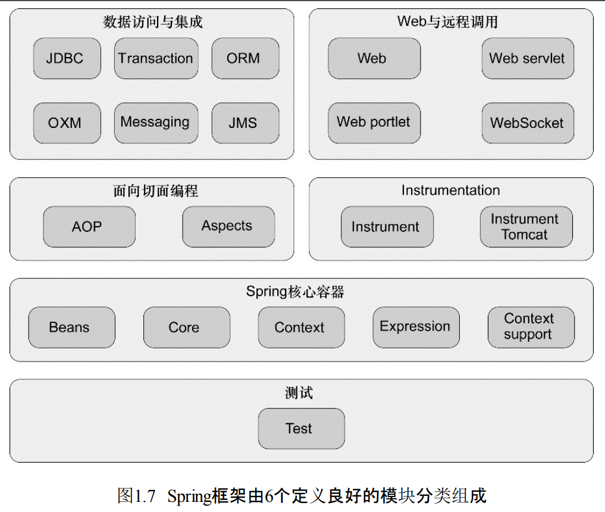

##

### DI依赖注入

通过DI，对象的依赖关系将由系统中负责协调各对象的第三方组件在创建对象的时候进行设定并转交给目标对象  
(目标)对象无需自行创建或管理它们的依赖关系

### 装配wiring

创建应用组件之间协作的行为称为装配

### Spring容器

Spring自带多个容器实现

1. bean工厂

    1. 接口：org.springframework.beans.factory.beanFactory
    
    2. 最简单的容器，提供基本的DI支持

2. 应用上下文

    1. 接口：org.springframework.context.ApplicationContext
    
    2. 基于beanFactory构建，提供应用框架级别的服务
    
        1. 如从属性文件解析文本信息
    
        2. 发布应用事件给感兴趣的事件监听者
    
    3. 应用上下文类型
    
        1. AnnotationConfigApplicationContext
    
            从一个或多个基于Java的配置类中加载Spring应用上下文
           
        2. AnnotationConfigWebApplicationContext
    
            从一个或多个基于Java的配置类中加载Spring Web应用上下文
           
        3. ClassPathXmlApplicationContext
    
            从路径下的一个或多个XML配置文件中加载上下文定义，把应用上下文的定义文件作为类资源
           
        4. FileSystemXmlApplicationContext
    
            从文件系统下的一个或多个XML配置文件中加载上下文定义
           
        5. XmlWebApplicationContext
    
            从Web应用下的一个或多个XML配置文件中加载上下文定义
           
### bean的生命周期

1. 实例化：Spring对bean进行实例化
2. 填充属性：Spring将值和bean的引用注入到bean对应的属性中
3. 接口实现
    1. Aware接口
        1. 如果bean实现了BeanNameAware接口，Spring将bean的ID传递给setBeanName()方法
        2. 如果bean实现了BeanFactoryAware接口，Spring将调用setBeanFactory()方法，将BeanFactory容器实例传入
        3. 如果bean实现了ApplicationContextAware接口，Spring将调用setApplicationContext()方法，将bean所在的上下文的引用传入进来
    2. BeanPostProcessor接口
        1. 如果bean实现了BeanPostProcessor接口，Spring将调用它们的postProcessBeforeInitialization()方法
    3. InitializingBean接口
        1. 如果bean实现了InitializingBean接口，Spring将调用它们的afterPropertiesSet()方法
        2. 如果bean使用init-method声明了初始化方法，该方法也会被调用
    4. 调用自定义的初始化方法       
    5. BeanPostProcessor接口
        1. 如果bean实现了BeanPostProcessor接口，Spring将调用它们的postProcessAfterInitialization()方法
4. bean准备就绪，可被应用程序使用，bean将一直驻留在应用上下文中，直到该应用上下文被撤销    
5. 销毁
    1. 如果bean实现了DisposableBean接口，Spring将调用它的destroy()接口方法
    2. 如果bean使用destroy-method声明了销毁方法，该方法也会被调用
    
### Spring功能模块

1. Spring核心容器
    1. Spring bean工厂：为Spring提供DI功能
    2. Spring上下文：基于bean工厂
    3. 企业服务：E-mail、JNDI访问、EJB继承和调度
2. Spring AOP模块
3. 数据访问与继承
4. Web与远程调用
5. Instrumentation
6. 测试

### Spring三种装配机制

1. XML中显示配置
2. Java中显示配置(JavaConfig)
3. 隐式的bean发现机制和自动装配

使用建议：

1. 尽可能使用自动配置，显示配置越少越好
2. 显示配置时，使用类型安全且比XML强大的JavaConfig
3. 想要使用遍历的XML命名空间，并且JavaConfig中没有同样的实现时，才应该使用XML

#### 自动化装配bean

Spring从两个角度实现自动化装配

* 组件扫描component scanning：Spring会自动发现应用上下文中所创建的bean
* 自动装配autowiring：Spring自动满足bean之间的依赖