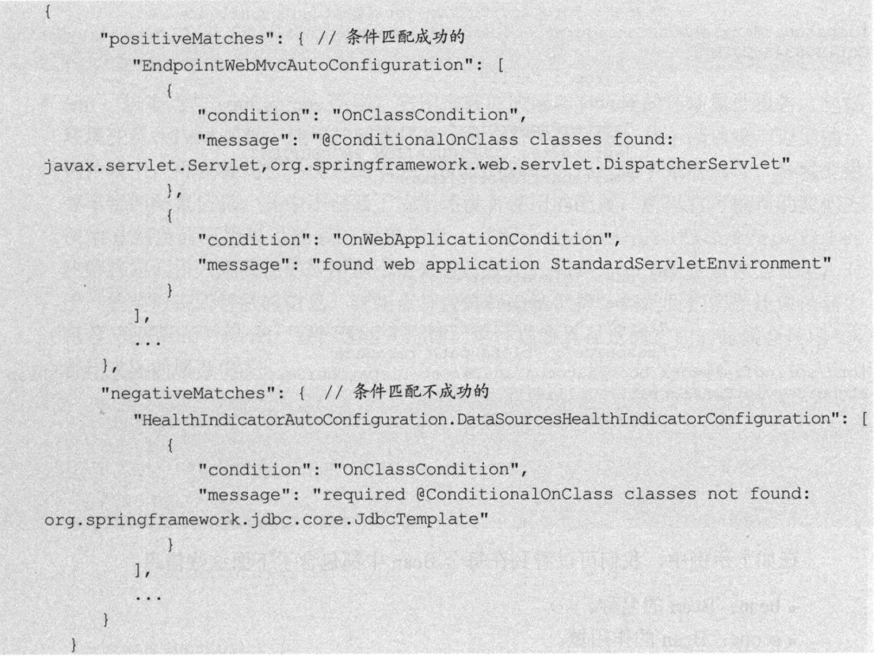

## 原生端点

### 应用配置类

获取应用程序中的应用自动化配置报告(autoconfig)、环境变量(env)、应用配置(env)等

* /autoconfig

    获取应用的自动化配置报告，包含每个候选项是否满足自动化配置的各个先决条件

    * positiveMatches
    
        返回条件匹配成功的自动化配置
    
    * negativeMatches
    
        返回条件匹配不成功的自动化配置
    
        

* /beans

    获取应用上下文中创建的所有Bean

    * bean：Bean的名称
    * scope：Bean的作用域
    * type：Bean的Java类型
    * dependencies：依赖的Bean名称

        
      
        
      
* /configprops

    获取应用中配置的属性信息报告

    * prefix：属性的配置前缀
    * properties：各个属性的名称和值
    
        可通过该报告查看各个属性的配置路径，如endpoints.configprops.enabled=false关闭该端点

        
      
        

* /env

    获取应用所有可用的环境属性报告，包含环境变量、JVM属性、应用的配置属性、命令行参数。可用@ConfigurationProperties将其引入到程序中

    
  
    

* /mappings

    返回所有SpringMVC的控制器映射关系报告

    * bean：标识该映射关系的请求处理器
    * method：标识该映射关系的具体处理类和处理函数
    
        
    
* /info

    返回应用自定义的信息，默认返回空JSON。可在application.properties文件中通过info.xxx设置属性

    

    

### 度量指标类

获取应用程序运行过程中用于监控的度量指标，比如内存消息、线程池信息、HTTP请求统计等

* /metrics
  
    返回当前应用的各类重要度量指标，如内存信息、线程信息、垃圾回收信息等

    * 系统信息
    
        * 处理器数量processors
        * 运行时间uptime、instance.uptime
        * 系统平均负载systemload.average
          
    * mem.*：内存信息概要，包括分配给应用的总内存数量以及当前空闲的内存数量。这些信息来自java.lang.Runtime
    
    * heap.*：堆内存使用情况。这些信息来自java.lang.management.MemoryMXBean接口中getHeapMemoryUsage方法获取的java.lang.management.MemoryUsage
      
    * nonheap.*：非堆内存使用情况。这些信息来自java.lang.management.MemoryMXBean接口中getNonHeapMemoryUsage方法获取的java.lang.management.MemoryUsage
      
    * threads.*：线程使用情况，包括线程数、守护线程数、线程峰值等。这些信息来自java.lang.management.ThreadMXBean
      
    * classes.*：应用加载和卸载的类统计。这些数据来自java.lang.management.ClassLoadMXBean
      
    * gc.*：垃圾收集器的详细信息。这些数据来自java.lang.management.GarbageCollectorMXBean
      
        * 垃圾回收次数：gc.ps_scavenge.count
        * 垃圾回收消耗时间：gc.ps_scavenge.time
        * 标记-清除算法的次数：gc.ps_marksweep.count
        * 标记-清除算法的消耗时间：gc.ps_marksweep.time
      
    * httpsessions.*：Tomcat容器的会话使用情况，仅在引入嵌入式Tomcat作为应用容器的时候才提供
      
        * 最大会话数：httpsessions.max
      
        * 活跃会话数：httpsessions.active
      
    * gauge.x：HTTP请求的性能指标之一，用于反应一个绝对数值
      
        * gauge.response.hello:5：表示上一次hello请求的延迟时间为5毫秒
      
    * counter.*：HTTP请求性能指标之一，作为计数器使用，记录了增加量和减少量

        * counter.status.200.hello:11：表示hello请求返回200状态的次数为11
  
            
          
            

    * star-star：对静态资源的访问
    
* /health
  
    获取应用的各类健康指标信息，spring-boot-starter-actuator自带一些常用资源的健康指标检测器，通过HealthIndicator接口实现(可自定义实现用于采集健康信息的检测器)
  
    
  
* /dump
  
    用于暴露程序运行中的线程信息。使用java.lang.management.ThreadMXBean的dumpAllThreads方法返回所有含有同步信息的活动线程详情
  
* /trace

    用于返回基本的HTTP跟踪信息。默认情况下，跟踪信息的存储采用org.springframework.boot.actuate.trace.InMemoryTraceRepository实现的内存够方式，始终保留最近的100条记录
  
    

### 操作控制类

提供对应用的关闭等操作类功能，原生端点只提供了一个用于关闭应用的端点

* /shutdown：可通过endpoints.shutdown.enabled=true开启