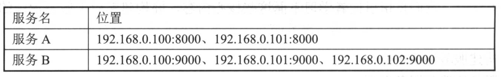

## 服务治理Spring Cloud Eureka

Spring Cloud Eureka是Spring Cloud Netflix微服务套件中的一部分，基于Netflix Eureka做了二次封装。

主要负责完成微服务架构中的服务治理功能

### 服务治理

最初构建微服务系统时服务数量较少，可通过静态配置完成服务的调用。

    如服务A调用服务B，为实现服务B的高可用，服务端负载均衡和客户端负载均衡都需要手工维护服务B的实例清单。
    随着业务发展，微服务不断增加，静态配置越发难以维护。
    集群规模、服务的位置、服务的命名等可能发生变化，手工维护容易出错或发生命名冲突等问题
    为此引入服务治理框架。

#### 服务注册

服务治理框架中通常会构建一个注册中心，每个服务单元向注册中心登记自己提供的服务。将主机与端口号、版本号、通信协议等一些附加信息告知注册中心，注册中心按照服务名分类组织服务清单。

#### 服务发现

服务治理框架下，服务间调用不再通过指定具体的实例地址来实现，而是通过向服务名发起请求调用实现。

此时服务调用方并不清楚服务提供方的具体服务实例位置，因此调用方需要向服务注册中心咨询服务，并希望获取所有服务的实例清单，以实现对具体服务实例的访问。

    如服务C希望调用服务A，服务C需要向注册中心发起咨询服务请求，服务中心会将服务A的位置清单返回给服务C，C获得服务A的两个可用位置。
    当服务C发起调用的时候，从该清单中以某种轮询策略取出一个位置进行服务调用，即客户端负载均衡

### Netflix Eureka

#### Eureka服务端

也称为服务注册中心，支持高可用配置。

如果Eureka以集群模式部署，当集群中有分片出现故障时，Eureka就转入自我保护模式。  
它允许在分片故障期间继续提供服务的发现和注册，当故障分片恢复运行时，集群中其他分片会把它们的状态再次同步回来。

    AWS上的实践为例，Netflix推荐每个可用的区域运行一个Eureka服务端，通过它来形成集群。
    不同的可用区域的服务注册中心通过异步模式互相复制各自的状态，意味着任意给定的时间点每个实例关于所有服务的状态会有细微差别

#### Eureka客户端

主要处理服务的注册与发现。