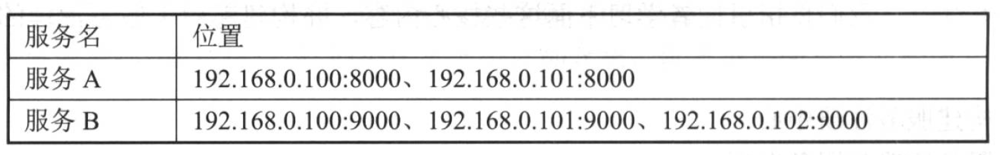
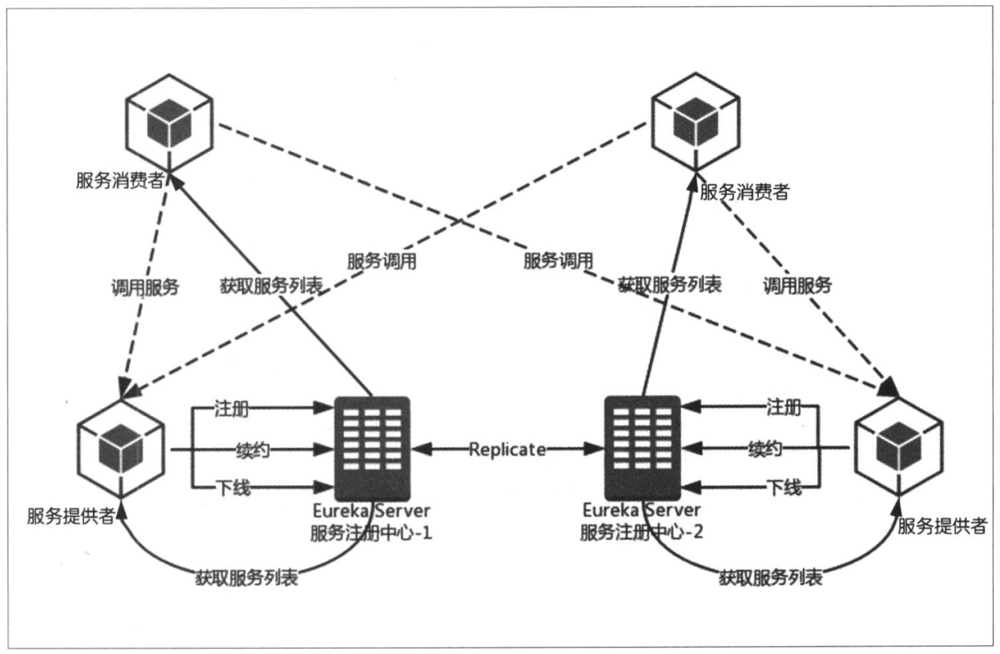

## 服务治理Spring Cloud Eureka

Spring Cloud Eureka是Spring Cloud Netflix微服务套件中的一部分，基于Netflix Eureka做了二次封装。

主要负责完成微服务架构中的服务治理功能

### 服务治理

最初构建微服务系统时服务数量较少，可通过静态配置完成服务的调用。

    如服务A调用服务B，为实现服务B的高可用，服务端负载均衡和客户端负载均衡都需要手工维护服务B的实例清单。
    随着业务发展，微服务不断增加，静态配置越发难以维护。
    集群规模、服务的位置、服务的命名等可能发生变化，手工维护容易出错或发生命名冲突等问题
    为此引入服务治理框架。

#### 服务注册

服务治理框架中通常会构建一个注册中心，每个服务单元向注册中心登记自己提供的服务。将主机与端口号、版本号、通信协议等一些附加信息告知注册中心，注册中心按照服务名分类组织服务清单。

#### 服务发现

服务治理框架下，服务间调用不再通过指定具体的实例地址来实现，而是通过向服务名发起请求调用实现。

此时服务调用方并不清楚服务提供方的具体服务实例位置，因此调用方需要向服务注册中心咨询服务，并希望获取所有服务的实例清单，以实现对具体服务实例的访问。

    如服务C希望调用服务A，服务C需要向注册中心发起咨询服务请求，服务中心会将服务A的位置清单返回给服务C，C获得服务A的两个可用位置。
    当服务C发起调用的时候，从该清单中以某种轮询策略取出一个位置进行服务调用，即客户端负载均衡

### Netflix Eureka

#### Eureka服务端

也称为服务注册中心，支持高可用配置。

如果Eureka以集群模式部署，当集群中有分片出现故障时，Eureka就转入自我保护模式。  
它允许在分片故障期间继续提供服务的发现和注册，当故障分片恢复运行时，集群中其他分片会把它们的状态再次同步回来。

    AWS上的实践为例，Netflix推荐每个可用的区域运行一个Eureka服务端，通过它来形成集群。
    不同的可用区域的服务注册中心通过异步模式互相复制各自的状态，意味着任意给定的时间点每个实例关于所有服务的状态会有细微差别

#### Eureka客户端

主要处理服务的注册与发现。

## Eureka服务治理基础架构

1. 注册中心
2. 服务提供者
3. 服务消费者

### 服务提供者

1. 服务注册
   
    1. 服务提供者启动时通过发送Rest请求(包含自身服务的元数据信息)将自己注册到Eureka Server
    
    2. Eureka按服务名分类组织：元数据信息存储在双层Map中
    
        1. 第一层key：服务名（参见Eureka信息面板）

        2. 第二层key：具体服务的实例名
    
    3. 默认eureka.client.register-with-eureka=true：false则不会注册到服务中心
    
2. 服务同步

    1. 注册中心服务同步
       
        1. 注册中心集群互相注册为服务，服务提供者发送注册请求到一个服务中心时，中心会将该请求转发给集群的其他中心，实现注册中心之间的服务同步
    
    2. 服务提供者相互获取
    
        1. 通过注册中心服务同步，服务提供者信息可以通过注册中心集群中任一一台获取
    
3. 服务续约Renew

    1. 注册玩服务后，服务提供者维护一个心跳用以告诉Eureka Server自己还存活，防止Eureka Server的"任务剔除"将服务实例从服务列表删除
    
    2. 服务续约属性
    
        1. 服务续约调用间隔时间(默认30s)
           
            eureka.instance.lease-renewal-interval-in-seconds=30
           
        2. 服务失效时间(默认90s)
    
            eureka.instance.lease-expiration-duration-in-seconds=90

### 服务消费者

1. 获取服务

    1. 服务消费者发送REST请求给服务注册中心，获取上面注册的服务清单
    2. Eureka Server维护一份只读的服务清单返回给客户端，该缓存清单每隔30秒更新一次，可通过下列参数修改默认时间
        
        eureka.client.registry-fetch-interval-seconds=30

2. 服务调用

    1. 服务消费者获取服务清单后，通过服务名获取具体的服务实例名和该实例的元数据信息
    2. Riboon中会默认采用轮询方式进行调用，实现客户端的负载均衡
    3. 访问实例的选择：Region和Zone
        1. 一个Region中可以包含多个Zone
        2. 每个客户端需要被注册到一个Zone中，每个客户端对应一个Region和一个Zone
        3. 服务调用时，优先访问同处一个Zone中的服务提供方；若访问不到，则访问其他Zone

3. 服务下线

   1. (主动/手动)关闭或重启服务的某个实例，即服务实例执行正常的关闭操作时，它会触发一个服务下线的REST请求给Eureka Server，告诉服务注册中心：我要下线了。
   2. 服务端接收到请求之后，将该服务状态设置为下线(DOWN)，并将该下线时间传播出去

### 服务注册中心

1. 失效剔除

    1. 由于内存溢出、网络故障等原因导致服务不能正常工作，而注册中心并未收到服务下线请求；  
       Eureka Server启动时会创建一个定时任务，默认每个60秒将当前清单中超时(默认90秒)没有续约的服务剔除出去

2. 自我保护

    1. Eureka Server运行期间会统计心跳失败的比例在15分钟之类是否低于85%
    
        1. 如果低于85(通常为网络不稳定导致)，则将当前的实例注册信息保护起来，让这些实例不会过期从而尽可能保护这些注册信息
        2. 如果在保护期间内服务实例出问题如网络断开，则客户端容易拿到不存在的服务实力，出现调用失败
        3. 因此客户端必须要有容错机制，比如使用请求重试、断路器等机制
    
    2. 可通过eureka.server.enable-self-preservation=false关闭保护机制
    