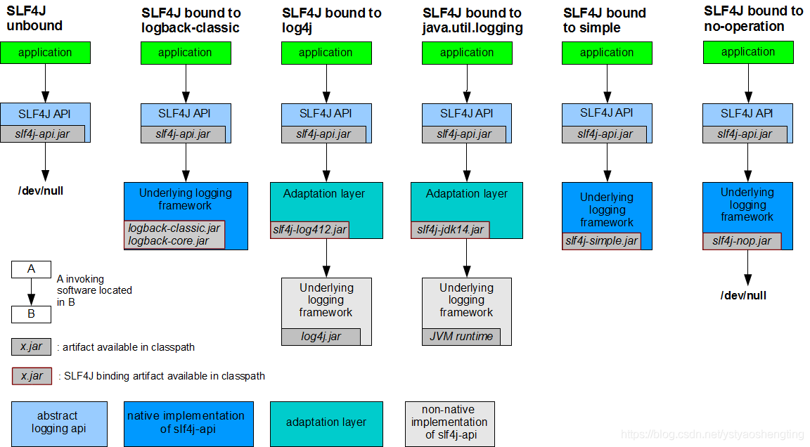

### SLF4J

定义：简单Java日志外观(simple logging facade for java)提供了不同的日志框架的外观。

SpringBoot默认使用logback-classic日志框架，该框架包含在spring-boot-starter中

#### 日志框架

* slf4j-log4j12-1.7.12.jar 

      绑定log4j 1.2版本，一个广泛使用的日志框架。也需要把log4j.jar包放到你的类路径中。

* slf4j2

      需要将日志外观log4j-api和日志框架实现log4j-core添加到类路径。

* slf4j-jdk14-1.7.12.jar 

      绑定java.util.logging，也被称为JDK 1.4日志。

* slf4j-nop-1.7.12.jar

      绑定NOP无操作，默默丢弃所有的日志。

* slf4j-simple-1.7.12.jar

      绑定简单实现（的日志框架），这个简单的日志框架将所有的事件输出到System.err。只有INFO级别以上的消息才被打印。这个绑定在小型应用程序可能会很有用。

* slf4j-jcl-1.7.12.jar

      绑定了Jakarta Commons Logging日志框架。这个绑定委派所有的SLF4J日志到JCL日志框架中。

* logback-classic-1.0.13.jar (requires logback-core-1.0.13.jar)

      本地实现。有一些在SLF4J工程之外的与SLF4J绑定，例如logback本身就实现了SLF4J。
      Logback的ch.qos.logback.classic.Logger类是SLF4J的org.slf4j.Logger接口的直接实现。因此，结合logback使用SLF4J节省很多内存和计算的开销。

#### 简单日志外观和绑定

